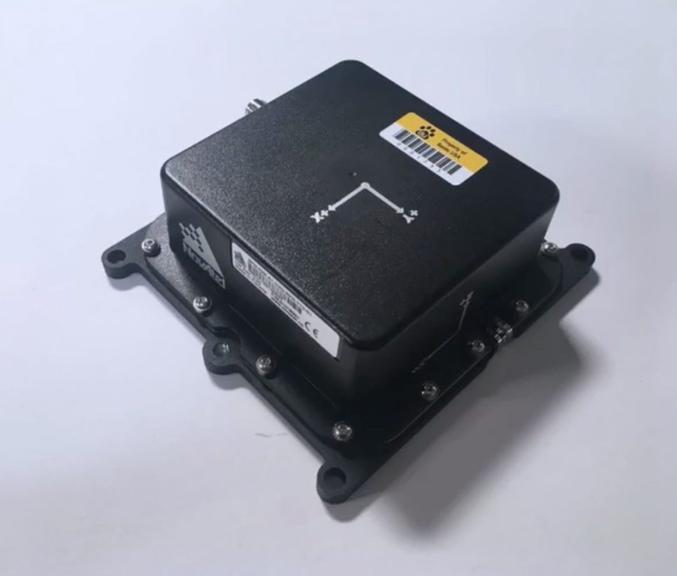
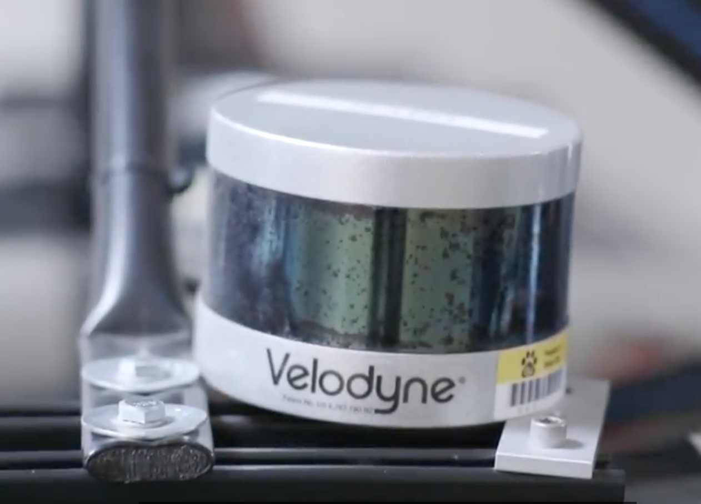

# self-driving-car

[TOC]

- core components of self-driving cars
- How baidu Apollo open source self-driving car software  implements these core components.
- How self-driving car work from one end to the other.

## Main part
Target: Understand how self-driving car work.

Main sections of the Apollo open-source self-driving car platform.

- high-definition maps(central module of self-driving car)
    underpin almost every other part of the software stack, include localization, perception, prediction and planning.

- localization
    How the car determines its location in the word.
- perception
    How self-driving car sees the world.Deep learning is an important and powerful tool for perception.  Convolutional neural networks which make up a branch of deep learning. are critical to perception tasks, such as classification, detection and segmentation.These approaches word with data from several different self-driving car sensors, including cameras, radar and lidar.
- prediction
    Different way to predict how other vehicle or pedestrains might move. How to combine predictin and routing to generate a trajectory for vehicle.
- planning
    Planning is one of the hardest parts of building a self-driving car.
- control
    Hot to use steering, throttle and break to execute planned trajectory. Several different types of controllers which range from simple to increasingly complex but also increasingly powerful.

## The history of the transportation

  One million yeas ago, our human ancestors begin to walk and run on two feet. This liberated out hands so that eventually, we could do things like walk and text at the same time.

  About 4,000 years ago, humans began building horse-drawn carriages. Carriages are actually one of the earliest examples of humans building vehicle.

  One hundred years ago, humans invented modern automobiles. Cars make it possible to go further and faster then ever before.

  Now we are at the cusp of a new era of self-driving cars. We hope that self-driving cars make the world safer and more productive, and better than ever before.

> Why do we need self-driving cars?

  The most important reason is safety. Human drives wind up in a lot of automobile collisions. Over one million people around the world die in automobiles crashes every single year; Self-driving cars have a lot of advantages over humans drivers. In particular, self-driving cars don't get drunk, and they don't get tired, and they don't get distracted.

  Self-driving cars also learn form each other. As humans, every one of us has to learn to drive from scratch, and we make almost of the same mistakes that our parents and grandparents made when they were learning to drive. Self-driving cars, on the other hand, learn to drive from each other self-driving car that has ever been on the road. So they immediately start out as experienced drivers.

  Self-driving cars also benefits beyond safety. Think about the last time you went to the grocery store, maybe over the weekend, and had to drive around and around looking for a parking spot. Now imagine a future world in which parking doesn't exist because a self-driving vehicle drops you off right where you need to be, just like a taxi or a ride-sharing vehicle. Think about how much more pleasant and a less stressful that world be.

Compare

Humans driving.
- High Traffic Accident Rate
- Learn to drive from scratch
- Parking Trouble

Self-driving cars.
- More Reliable Driving
- Learnable Driving System
- No Parking Trouble

  The Society of Automotive Engineers identifies six levels of autonomous vehicles, zero through five.

- Level zero is the base level. At this level, the drives is the sole decision-marker for the system. The driver controls the steering wheel, throttle, breaks and all other vehicle controls.
- Level one is Drive Assistance. At this level, the vehicle support the driver with ether steering or acceleration. Cruise control, for example, is a level one automation system. At this level, drivers must stay fully engaged, but they can give up some control to the autonomous system.
- Level two is partial automation. At this stage, the vehicle controls several functions automatically such as automatic cruise control and lane keeping. However, the driver must still perform any functions that the autonomous system does not handle.
- Level three is conditional automation. The vehicle drives autonomously, but the driver must be ready to tike over whenever necessary.
- Level four is high automation. At this level, the vehicle controls all aspects of the driving experience and there is no expectation that the human driver will ever intervene. In fact, at this level, ti's possible that the vehicle might not even have a steering wheel or driver controls at all. However, at this level, the vehicle may be restricted to certain areas. Often, this is called a geofence. The vehicle can operate completely autonomously within a certain geofence, but outside of that geofence, the vehicle is either unable to operate autonomously or maybe unable to operate at all.
- Level five, the highest level, is full automation. At this level, the vehicle operates completely autonomously anywhere and everywhere that a human can drive. Level five should be automation as good or better than a human driver in all scenarios.  

## Self-driving car history

  Research into self-driving cars began in the 1980s. In 1986, Carnegie Mellon University's NavLab built one of the first self-driving cars that was ever controlled by a computer.
  In 1995, Mercedes Benz completed the Eureka Prometheus Project, which was the largest autonomous vehicle research and development program in history up to that time. This project redefined the state of the art for self-driving vehicles. Many universities and car manufacturers participated in this pan-European project from 1987-1995.
  In 2005, Sebastian Thrun, who was also the founder of Udacity, Led the Stanford racing team that won the DARPA Grand Challenge, a 100 mile self-driving car race through the California desert. Aster winning the DARPA Grand Challenge, Sebastian joined Google and started the Google self-driving car project in 2009. Over the last few years, self-driving car tests have launched in San Fransisco, and Phoenix, and Las Vegas, and Detroit, and Boston, and Beijing, and many other cities all around the world.
  In 2017, Baidu released an open-source self-driving car project called Apollo. This platform helps partners integrate their own vehicles and hardware systems to build complete autonomous systems. An autonomous vehicle is comprised of special purpose computers and sensors. autonomous computing units are 10 times faster the personal computers or more.
  In the Apollo system, the vehicles's onboard computing units are supported by a massively powerful cloud cluster. Any given autonomous vehicles has many advanced sensors that perform tasks like perception and localization. With artificial intelligence and these sensors, the vehicles can operate itself independently of any human driver.

## How the self-driving car work

  Self-driving car have 5 core components.
  - Computer vision
  - Sensor Fusion
  - Localization
  - Path planning
  - Control
Computer vision is how we use camera images to figure out what the word arounds us looked like and sensor fusion is how we incorporate data from other sensors like lasers and radar to get a richer understanding of our environment. Once we built this deep understanding of what the word around us is, we use localization to figure out precisely where we are in that word and then once we figured out where we are in the world and what the world looks like, we use path planning to chart a course through the world to get us where we'd like to go and then the final step is control, which is how we actually turn the steering wheel and hit the throttle and hint the break in order execute the  trajectory that we built during the path planning.

But Apollo platform structure is a little different from this. Apollo is use high-definition maps and localization module as the core, and other all based on these tow.

Apollo open-source platform provides hardware specifications on vehicle software, and cloud services,  high-definition map services and then open autonomous driving simulation engine. Apollo technology framework consists of four layers, reference vehicle platform, reference hardware platform, open software platform, and cloud services platform. we will learn how they integrate to create an end-to-end self-driving car.

> reference vehicle platform

It's also called drive-by-wire vehicle

> reference hardware platform.

The car have several sensors which are defined by the hardware reference specification. The Controller Area Network or CAN, is the vehicle's internal communication network.

The CAN card, is how your computer system connects to the car internal network, to send signals for acceleration, braking and steering.

The Global Position System or GPS receives signals from satellites, circling the earth. The signals help us to determine our location.

 The internal measurement unit or IMU, measures the vehicle movement and location, by tracking the position, speed, acceleration and other factors.

LiDAR is an array of pulse lasers, the LiDAR that Apollo uses can scan 360 degrees around the vehicle.

The reflection of this laser beams, builds the points cloud that our software that our software can use understand the environment.

Camera capture the images data. We can use computer vision to extract the contents of these images and understand the environment around us. For example, because the cameras can perceive color, we use theme to detect and understand the traffic light.

Radar is also used for detecting obstacles. Radar has low resolution, which makes it difficult to understand what kind of obstacle that radar have detected. But the advantage of radar are that it is economical and it works in all weather, and lighting condition. Radar is also particularly very good at measuring the speed of other vehicles.

Here is an example of how the major hardware components including camera, radar, LiDAR, GPS-IMU and IPC could be installed on a vehicle. This hardware is what you need to run Apollo.

> open software platform

Overall framework: The open software layer is divided into three sub layers: real-time operating system(ROTS), Runtime framework and a layer of application modules.

The real-time operating system guarantees that certain task will be completed within a given time.  Real-time refers to the fact that operating system of self-driving car can produce timely calculations, analysis and execute corresponding actions in a short time, aster the car sensors collect the data form the outside world. For example, imagine a self-driving car 

> cloud services platform
